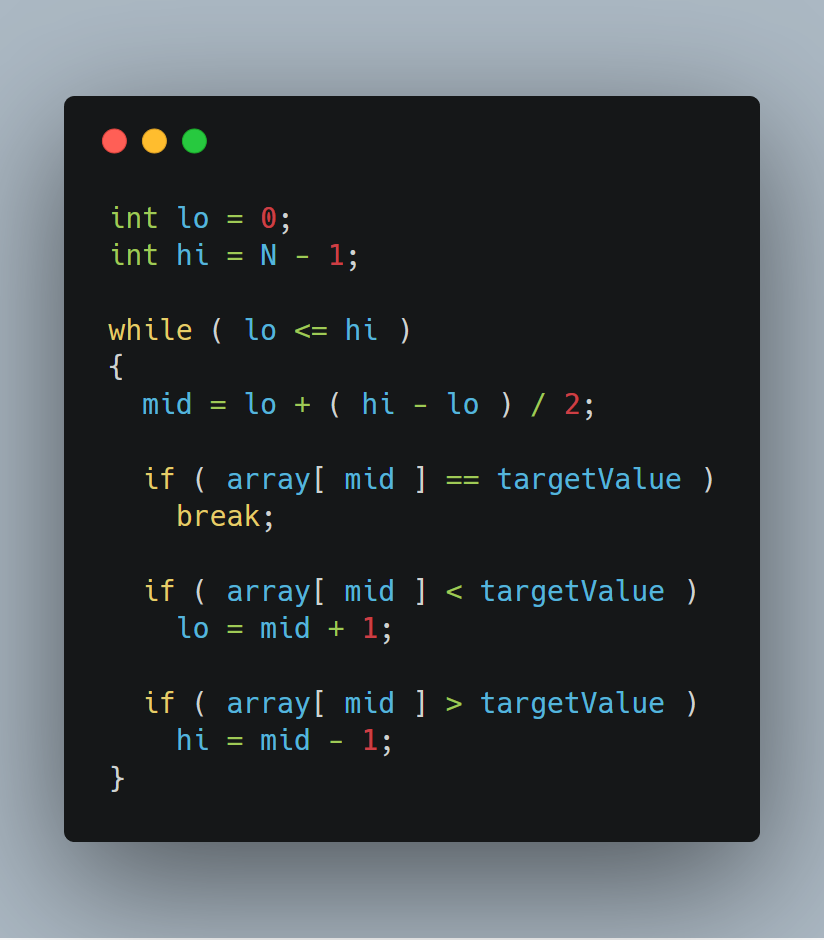

# Binary Search

## Motivating Problem I

Imagine that you have a phone book and want to find your friend's phone number.

With so many people listed, how do you efficiently search for your friend's last name?

## Motivating Problem II

You ask your friend to think of a number between 1 and 100; you attempt to guess what number they're thinking of, and they will tell you if the number you guessed is bigger or smaller than their number.

You keep doing this until you successfully find their number; the number of guesses you had is your score, so you attempt to minimize your score.

Since there are only 100 numbers, your score should be relatively small, but what if you told your friend to think of a number between 1 and 1,000,000?

How can we quickly find what number they are thinking of?

## Definition

One of the fundamental algorithms in computer science, the *binary search* algorithm is used to quickly find a value in a sorted sequence.

The algorithm works by repeatedly dividing in half the portion of the sequence that could contain the target value, until you've narrowed down the possible locations to just one.

## Time Complexity

Suppose we have a sorted sequence of 32 numbers.

If we randomly guess, the maximum number of guesses that it will take to find the target number will be 32.

If we use binary search, the maximum number of guesses that it will take to find the target number will be 5.
- Remember that every guess eliminates half of the remaining sequence

Now, suppose we have a sorted sequence of **_N_** numbers.

If we randomly guess, the maximum number of guesses that it will take to find the target number will be **_N_**.

If we use binary search, the maximum number of guesses that it will take to find the target number will be **_log(N)_**.

How much faster is **_log(N)_** than **_N_**?

|    **_N_**    | **_log(N)_** |
| ------------- | ------------ |
| 10            | ~3           |
| 100           | ~7           |
| 10,000        | ~13          |
| 1,000,000     | ~20          |
| 1,000,000,000 | ~30          |

## Pseudocode

Let's say that we want to code the binary search algorithm to find a target value in a sorted array of numbers.

We will use two variables, `lo` and `hi`, to represent the indices of the first and last element of the section of the array that we are currently looking at.

Let's call the index of the middle number in this target section `mid`, which can be found by finding the average of `lo` and `hi`.

There are three possible scenarios:

1: `array[mid] == targetValue`

If the middle number of our current sequence is equal to the target value, we have found what we are looking for and are done

2: `array[mid] < targetValue`

If the middle number of our sequence is less than the target value, then we know that the bottom half of the current sequence can be eliminated.

We can adjust the sequence by setting `lo = mid`

3: `array[mid] > targetValue`

If the middle number of our sequence is greater than the target value, then we know that the top half of the current sequence can be eliminated.

We can adjust the sequence by setting `hi = mid`

Now that we have the three possible scenarios handled, we just need to define when to terminate the loop if we never found our target value.

We want to keep searching while we have some range of numbers to check, so if `lo` ever becomes greater than `hi`, then our target value is not in the array due to the fact that we have run out of numbers to check.

## Problems

- [Hacking the random number generator](http://www.spoj.com/problems/HACKRNDM/)
- [Pizzamania](http://www.spoj.com/problems/OPCPIZZA/)
- [Aggressive cows](http://www.spoj.com/problems/AGGRCOW)
- [ABCDEF](http://www.spoj.com/problems/ABCDEF)
- [Subset Sums](http://www.spoj.com/problems/SUBSUMS/)
- [Cutting Cheese](icpc.kattis.com/problems/cheese)
- [Mountain Walking](http://www.spoj.com/problems/MTWALK/)
