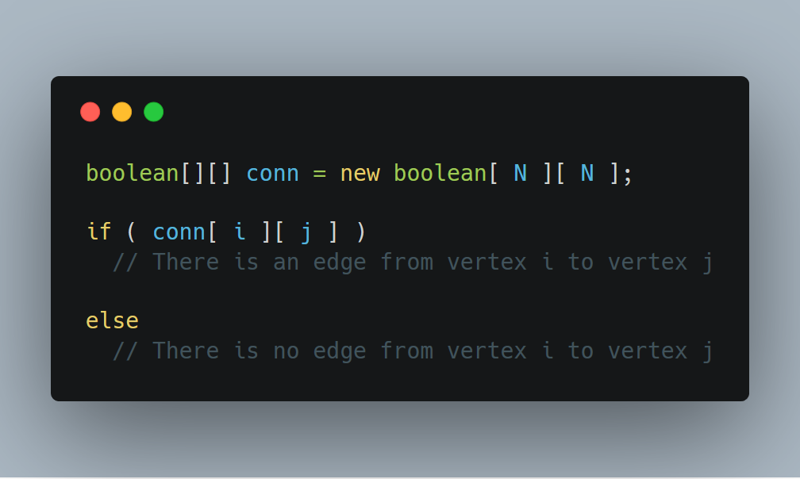
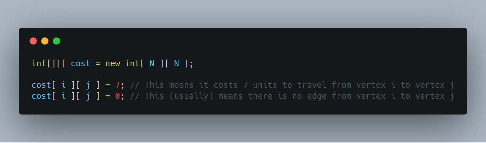
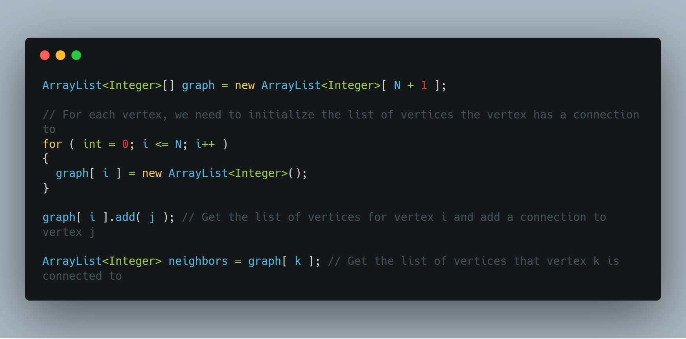

# Graph Theory

## What is a Graph?

A _graph_ consists of _vertices_ (or nodes) and _edges_ (or paths)

Edges
- are connections between vertices
    - _e.g._, roads between cities
- can have one-way direction or can be bidirectional
- can have weights
    - _e.g._, time to travel between two cities

A _directional graph_ has edges that are all directional (_i.e._, if there's an edge from _A_ to _B_, there might not be one from _B_ to _A_)

An _acyclic graph_ contains no cycles (in a directed graph, there's no path starting from some vertex _v_ that will take you back to _v_)

A _weighted graph_ contains edges that hold a numerical value (_e.g._, cost, time, etc.)

### Unweighted, undirected graph

### Unweighted, directed cyclic graph

### Unweighted, directed acyclic graph

### Weighted, undirected graph

### Complete graph

A _complete graph_ is a graph where each vertex has an edge to all other vertices in the graph 

## Representing a Graph

There are two main ways to represent a graph:
1. _Adjacency matrix_
2. _Adjacency list_

### Adjacency Matrix

An adjacency matrix uses a 2-dimensional array to represent edges between two vertices

There are many ways to use an adjacency matrix to represent a matrix, but we will look at two variations

#### Connection matrix

#### Cost matrix

#### Pros and Cons

_Pros_
- Easy to check if there is an edge between _i_ and _j_
    - calling `matrix[ i ][ j ]` will tell us if there is a connection

_Cons_
- To find all neighbors of vertex _i_, you would need to check the value of `matrix[ i ][ j ]` for all _j_
- Need to construct a 2-dimensional array of size _N_ x _N_

### Adjacency List

Rather than making space for all _N_ x _N_ possible edge connections, an _adjacency list_ keeps track of the vertices that a vertex has an edge to.

We are able to do this by creating an array that contains `ArrayLists` holding the values of the vertices that a vertex is connected to.

#### Pros and  Cons

_Pros_
- Saves memory by only keeping track of edges that a vertex has
- Efficient to iterate over the edges of a vertex
    - Doesn't need to go through all _N_ vertices and check if there is a connection

_Cons_
- Difficult to quickly determine if there is an edge between two vertices

## Trees

A _tree_ is a special kind of graph that exhibits the following properties:
1. Acyclic graph
2. _N_ vertices with _N_-1 edges

The graphs above that we used for BFS and DFS were both trees.

Above is another example of a tree.

## Problems

- [Is it a tree](http://www.spoj.com/problems/PT07Y/)
- [Bitmap](http://www.spoj.com/problems/BITMAP/)
- [VALIDATE THE MAZE](http://www.spoj.com/problems/MAKEMAZE/)
- [Meeting For Party](http://www.spoj.com/problems/DCEPC706/)
- [Slick](http://www.spoj.com/problems/UCV2013H/)
- [Escape from Jail Again](http://www.spoj.com/problems/ESCJAILA/)
- [A Bug's Life](http://www.spoj.com/problems/BUGLIFE/)
- [Longest path in a tree](http://www.spoj.com/problems/PT07Z/)
- [Treeramids](http://www.spoj.com/problems/PYRA/)
- [Lucius Dungeon](http://www.spoj.com/problems/BYTESE1/)
- [Mountain Walking](http://www.spoj.com/problems/MTWALK/)
