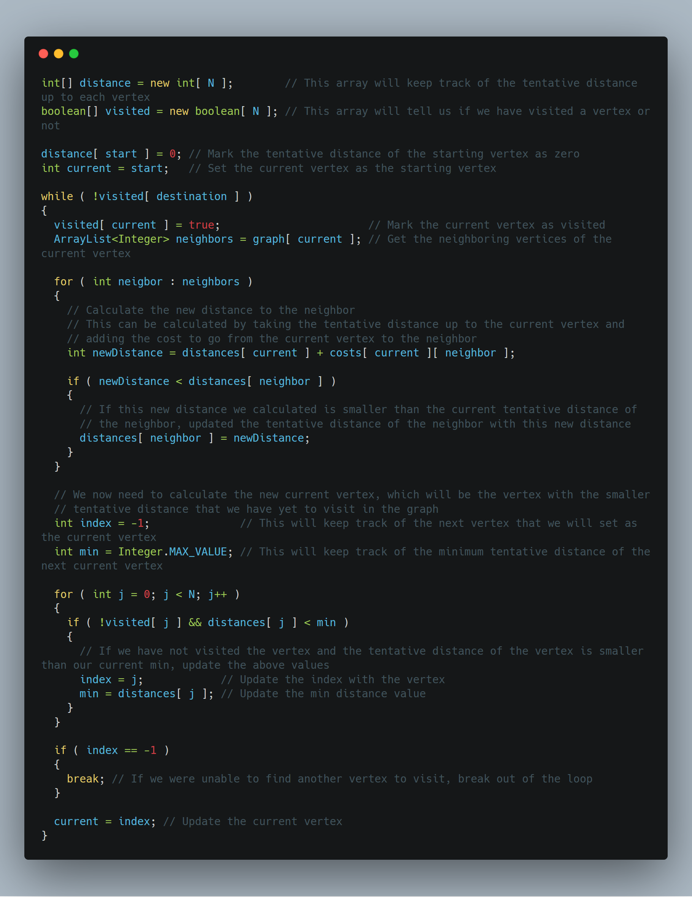
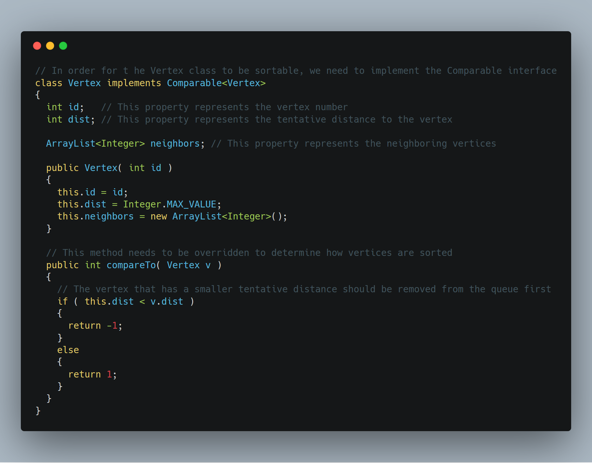
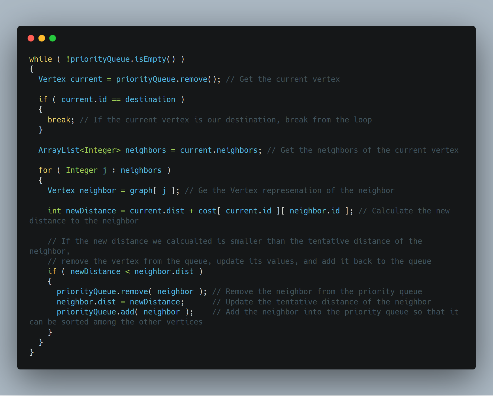

# Dijkstra's Algorithm

## Motivating Problem

Imagine that we have a graph of flights across the country, and each flight has a given cost and time.

We want to find a series of flights from city _A_ to city _B_ such that the cost (or time) is minimized.

We can generalize this problem to the following:

Given a graph _G_ and a starting vertex _s_, what is the _shortest path_ from _s_ to any other vertex of _G_?

This problem is called the _Single-Source Shortest Paths_ (SSSP) problem.

## Single-Source Shortest Path

#### SSSP on an unweighted graph

If the graph is unweighted (or if all of the edges have equal or constant weight), we can use the BFS algorithm in order to solve this problem.

BFS goes "level-by-level", so it would visit all vertices that are one unit away first, and then two units away, and then three units away, etc.

The fact that BFS visits vertices of a graph "level-by-level" from a source vertex turns BFS into a natural choice to solve the SSSP problem on unweighted graphs.

### SSSP on a weighted graph

If the given graph is weighted, BFS no longer works. This is because there can be "longer" paths from the source to vertex, but has a smaller cost than the "shorter" path found by BFS.

To solve the SSSP problem on weighted graphs, we use a greedy algorithm: _Dijkstra's Algorithm_

## Dijkstra's Algorithm

### Procedure

1. Give every vertex a tentative distance
    - the initial vertex will have a distance of zero
    - every other vertex will have a distance of infinity
2. Set the initial vertex as the current vertex; mark all other vertices unvisited
3. For the current vertex, consider all of its unvisited neighbors and calculate the tentative distance to each vertex; compare the newly calculated distance to the current assigned value and set the tentative distance to the smaller distance
4. When we are done considering all of the neighbors of the current vertex, mark the current vertex as visited
5. If the destination vertex has been marked visit, or if the smallest tentative distance among unvisited vertices is infinity, stop the algorithm
6. Select the unvisited vertex that is marked with the smallest tentative distance, and set it as the new current vertex, then go back to step 3


Above is a visual representation of Dijkstra's Algorithm

### Coding Dijkstra's Algorithm

There are several ways to implement this algorithm
- `int[] distance`
- `PriorityQueue<Vertex>`

#### Using an array



#### Using a priority queue

Remember that as you add items to a priority queue, they are automatically sorted within the queue, so that you are given the "smallest" item when you remove it from the queue.

First, we need to define our `Vertex` class and what attributes it will contain.



Remember that when we used `dist[]` to keep track of distances, we had to look through _all_ tentative distances to see which vertex to visit; with this method, we just remove the next vertex from the priority queue and it will be guaranteed to have the smallest distance.

Now that we have our `Vertex` class setup, how do we use it to implement Dijkstra's algorithm?

Let's start by creating all of the vertices of a graph and storing them into an array.

```java
Vertex[] graph = new Vertex[ N ];

// For each vertex in the graph...
for ( int i = 0; i < N; i++ )
{
    // Initialize the Vertex object corresponding to the vertex
    graph[ i ] = new Vertex( i );
}

graph[ i ].neighbors.add( j ); // Add vertex j as a neighbor of vertex i
```

We know the tentative distance of our source vertex is zero, so we can assign that value and add the vertex to the priority queue.

```java
vertex[ source ].dist = 0;
priorityQueue.add( vertex[ source ] );
```

Just like BFS, we are repeating the steps of the algorithm until the queue is empty. This makes sense for Dijkstra's algorithm since we want to keep repeating the process until we either
- run out of vertices (queue is empty), or
- reach our destination vertex

Now that we have our stopping condition, we can implement the rest of the algorithm



## Problems

- [106 miles to Chicago](http://www.spoj.com/problems/CHICAGO/)
- [Highways](http://www.spoj.com/problems/HIGHWAYS/)
- [Mice and Maze](http://www.spoj.com/problems/MICEMAZE/)
- [ABC Path](http://www.spoj.com/problems/ABCPATH/)
- [COSTLY CHESS](http://www.spoj.com/problems/CCHESS/)
- [Shopping](http://www.spoj.com/problems/SHOP/)
- [Prime Path](http://www.spoj.com/problems/PPATH/)
- [The Benefactor](http://www.spoj.com/problems/BENEFACT/)
- [Fishmonger](http://www.spoj.com/problems/FISHER/)
- [Fool the Police](http://www.spoj.com/problems/FPOLICE/)
- [Electric Car Rally](http://www.spoj.com/problems/CARRALLY/)
